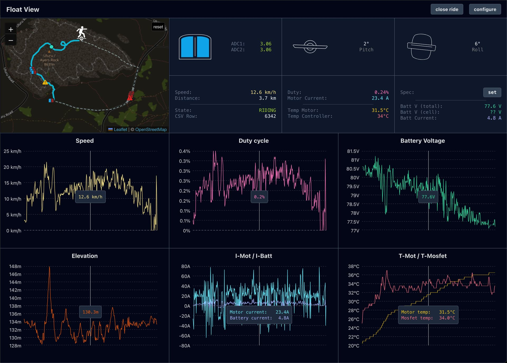
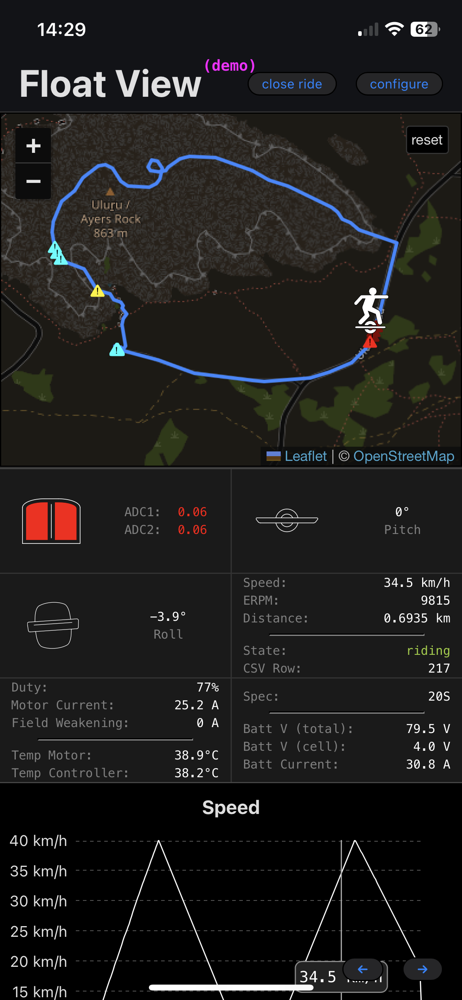

# Float View

A tool to view rides recorded with [Float Control] or [Floaty]. I made it so I could easily analyze specific parts of my ride when troubleshooting custom boards, whether I'm using a desktop or mobile device.

Use it here: <https://acheronfail.github.io/float-view/>!

Main features:

- Works on Desktop or Mobile devices
- Should be buttery smooth on all devices, even for long rides!
- Ability to highlight parts of the ride when footpad sensors are off or partially off
- Ability to zoom into parts of the map (also zooms the charts!!)
- Can be saved as an applet on mobile devices for offline use
- And more!

## Demo

Also works great on mobile devices:

And can be saved as an app to your phone's home screen, by:

1. Opening the website in your browser
2. Clicking the Share button
3. Selecting `Add to Home Screen`

Now you'll have `Float View` all the time, even offline!

## How do I use it?

1. Get on your board and record a ride with [Float Control] or [Floaty]
2. Export your ride data (Float Control will put it in a `.csv.zip`, Floaty in a `.json`)
3. Load it up in <https://acheronfail.github.io/float-view/> (if it's zipped, unzip it first!)
4. Enjoy!

[Float Control]: https://apps.apple.com/us/app/float-control-vesc-companion/id1590924299
[Floaty]: https://play.google.com/store/apps/details?id=com.floaty.floatyapp&pcampaignid=web_share
